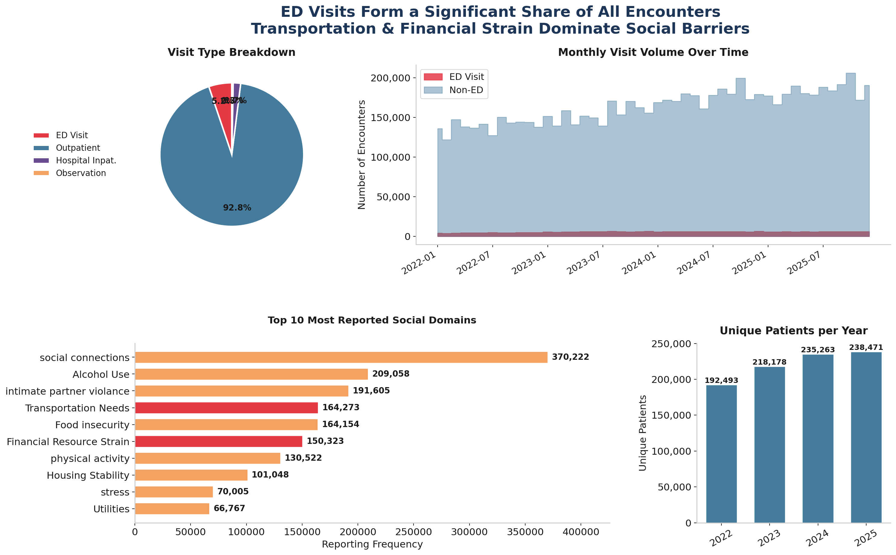
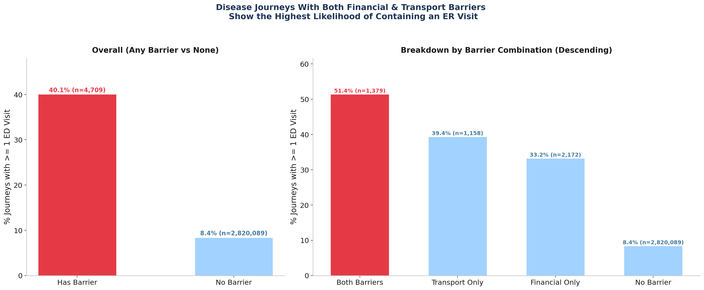
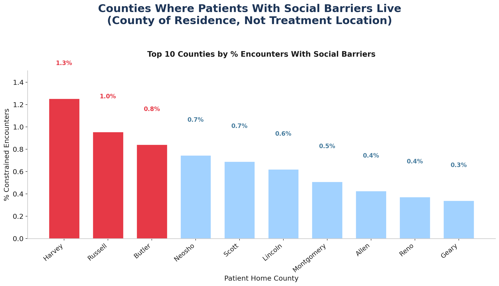
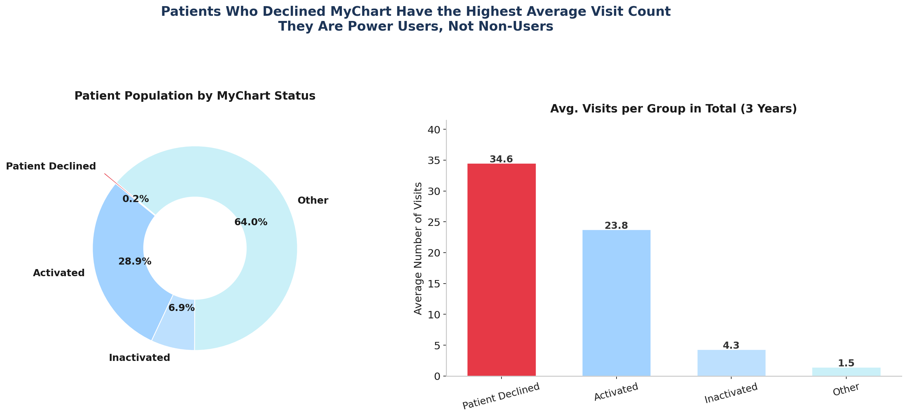
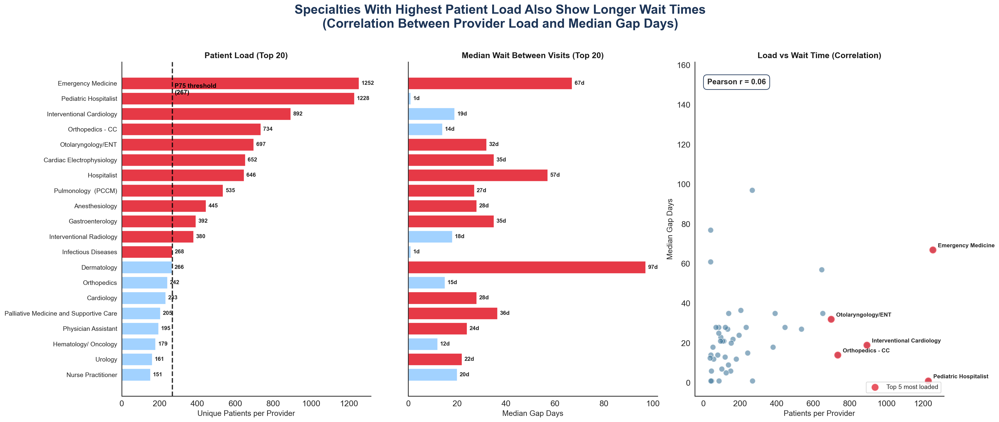

# ASA DataFest 2026 — Social Barriers & ED Overutilization

Analysis of four years of real patient encounter data from **Stormont Vail Health (SVH)**
to answer: are patients ending up in the Emergency Department because their condition
suddenly worsens — or because social barriers (transportation, financial strain) leave
them with no other option?

**Team "Immortal"** (4 members): Hillal Hariyono, Hans Richard Djojosantoso,
Ryan Christopher Setiawan, Vinson Nicholas Sorensen.

## Key findings

- Disease journeys of patients reporting **any social barrier** contained an ED visit **40.1%**
  of the time, vs. **8.4%** for no-barrier journeys — roughly **5× higher**. Barrier journeys:
  n = 4,709 (transport only 1,158, financial only 2,172, both 1,379).
  This is an **association, not a causal estimate** — barrier and non-barrier patients also differ
  in age, health status and income, any of which independently raises ED use. No significance test
  was run; a chi-square or two-proportion z-test is the obvious next step, and a 32-point gap at
  this sample size would almost certainly clear it.
- External validation against **ACS Census** vehicle-ownership data confirms the pattern
  independently: transport self-reports rise from 2.9% (well-connected neighborhoods) to
  9.8% (>15% of households lack a car) — a 3.3× increase, collected via a completely
  different methodology than the SVH survey.
- The top diagnoses among barrier patients are chronic, manageable conditions (hypertension,
  diabetes, routine exams) — not emergencies. These are routine-care failures, not acute crises.
- Patients who declined the MyChart patient portal average **34.6 visits/3yr**, ~50% more than
  activated users (23.8) — they're not digitally disengaged non-users, they're high-need
  patients showing up in person every time instead.
- System-side: Emergency Medicine carries **~5× the P75 patient-load threshold**, and post-ED
  referrals to other departments face wait times of 115–248 days.

Full findings, methodology, and the three recommended interventions are in
[`ASA Datafest Immortal - Writeup.pdf`](<ASA Datafest Immortal - Writeup.pdf>) (the document
submitted to the competition) and the poster deck
[`ASA Datafest Immortal - PPT.pptx`](<ASA Datafest Immortal - PPT.pptx>).

## Visuals

## Notebooks

- **[`analysis_notebook.ipynb`](analysis_notebook.ipynb)** — the primary analysis notebook:
  barrier classification, ED-rate comparison, ACS Census external validation, MyChart digital-gap
  analysis, and system bottleneck mapping (provider load, referral wait times). This is what
  generated the charts in `plots_story/`, the writeup, and the poster.
- **[`extended_analysis_cost_exploration.ipynb`](extended_analysis_cost_exploration.ipynb)** —
  a follow-up exploration estimating the dollar cost of avoidable ED visits (~$4M/year using
  national HCUP cost averages). **This was an internal exploration, not part of the submitted
  deliverable** — it isn't in the writeup or poster, so it's kept separate and clearly labeled
  rather than presented as an official result.

## Data

Built on 7 datasets provided by Stormont Vail Health and DataFest organizers, plus ACS Census
extracts — about **14.4 million rows** in total, spanning Jan 2022 – Dec 2025:

| Table | Rows |
|---|---|
| `encounters` | 7,675,801 |
| `social_determinants` | 3,977,901 |
| `diagnosis` | 1,531,262 |
| `patients` | 947,685 |
| `providers` | 299,075 |
| `departments` | 11,597 |
| `tigercensuscodes` | 2,463 |

Encounters by year: 1.63M (2022), 1.81M (2023), 2.08M (2024), 2.16M (2025).

**Raw data is not included in this repo.** It contains real (if aggregated/de-identified)
hospital patient records provided under the competition's data-use agreement and isn't ours to
redistribute. `.gitignore` excludes it entirely; see
[`Read Me_ About the Data.docx`](<Read Me_ About the Data.docx>) for the schema if you have
access to the original dataset separately.

## Methodology summary

1. **Barrier classification** — patients grouped into No Barrier / Financial Only / Transport
   Only / Both Barriers from actual SVH survey responses (not just "was asked" — corrected from
   an earlier, looser definition during the analysis).
2. **ED comparison** — the unit of analysis is a *disease journey*: one
   `(PatientDurableKey, DiagnosisValue)` pair, i.e. one patient's encounters for one diagnosis.
   The measure is the **share of journeys that contain at least one ED visit**, compared across
   barrier groups — not a per-patient visit rate.
3. **External validation** — cross-checked against ACS 5-Year Census data (vehicle ownership by
   block group) collected independently of SVH, to confirm the barrier effect isn't an artifact
   of who happened to be surveyed.
4. **Digital gap analysis** — MyChart adoption status vs. visit frequency and age cohort.
5. **System bottleneck mapping** — patient-to-provider ratios, referral wait times, ED outflow
   as a directed graph.

## Tech stack

Python, pandas, matplotlib/seaborn, US Census ACS 5-Year data (via API).

---
*ASA DataFest 2026 (Data Science Competition), Mathematical Challenge Festival ITB.*
